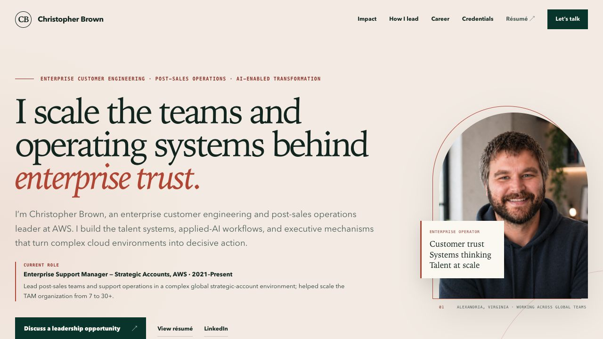
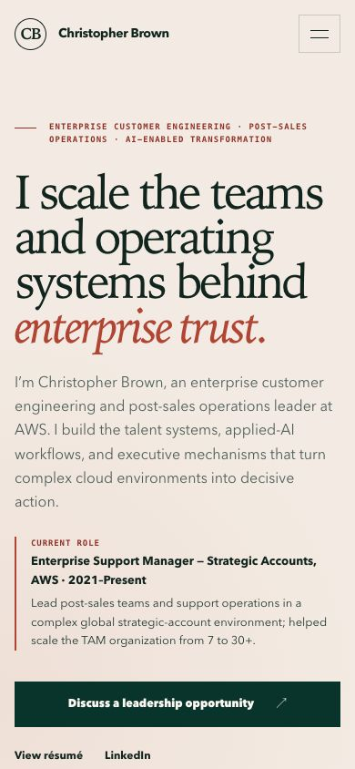

# Detailed redesign review

This branch contains the complete employer-focused redesign. The live site on `main` is unchanged.

## Desktop hero



## Mobile hero



## Positioning

The site now markets Christopher as an **enterprise customer engineering and post-sales operations leader**, differentiated by:

1. strategic-account trust and support transformation;
2. applied AI embedded in real operating workflows;
3. repeatable talent and leadership systems.

Applied AI supports the leadership story rather than replacing it with generic AI branding.

## Page structure

1. Exact current role, target lane, and validated scale above the fold
2. Public-safe proof strip
3. Three decision-and-outcome case studies
4. Four-step leadership operating model
5. Full career progression from engineering to strategic accounts
6. Executive communication and writing differentiator
7. Patents, precise education wording, and selected credentials
8. Recruiter-focused contact call to action

## Recruiter review

An independent executive-recruiter agent reviewed the positioning before implementation and again after the full build. Final verdict: the page is in the **contact** column for Director/Head-level customer engineering, enterprise support, TAM, strategic accounts, and AI-enabled post-sales roles.

Its recommendations were incorporated:

- exact current title and `7 to 30+` scale signal above the fold;
- recent cross-company support transformation as the lead case;
- careful attribution for AI adoption and the Principal-level promotion;
- public-safe metrics and anonymized customers;
- plain-language explanation for internal programs;
- a new two-page résumé aligned with the site.

## Technical validation

- Lighthouse mobile: 99 Performance / 100 Accessibility / 100 Best Practices / 100 SEO
- Lighthouse desktop: 100 / 100 / 100 / 100
- Mobile LCP: 1.8s in the local audit
- Desktop LCP: 0.4s in the local audit
- Zero measured layout shift
- Validated at 390px mobile width with no horizontal overflow
- Mobile navigation open/close behavior verified
- HTML validation passes
- No browser console warnings or errors
- All local assets return HTTP 200
- Two-page résumé rendered and visually inspected page by page

## Local interactive review

```bash
python3 -m http.server 4187 --bind 127.0.0.1
```

Open [http://127.0.0.1:4187/](http://127.0.0.1:4187/).
