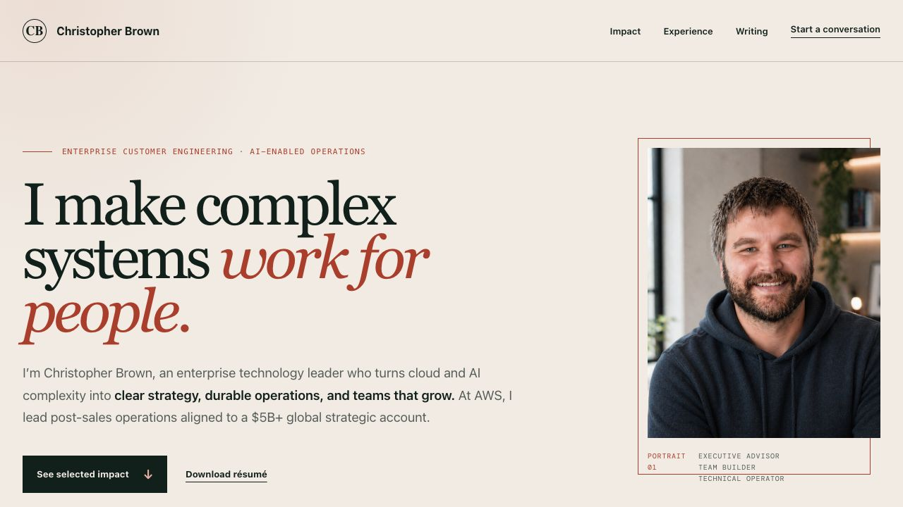
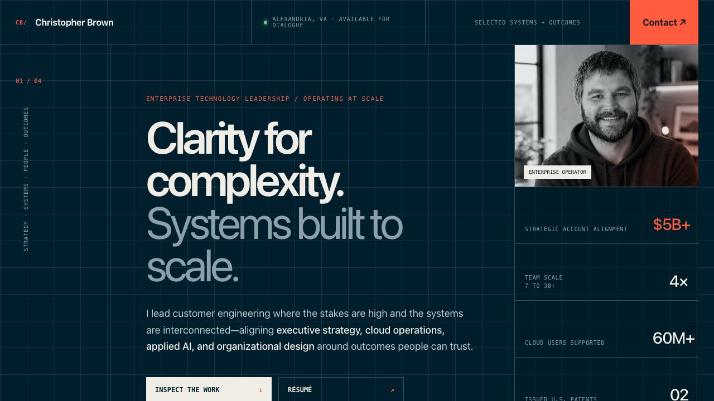

# Employer-focused redesign concepts

These three standalone homepage concepts compare visual direction before the production site is rebuilt. They intentionally share the same source-backed positioning and public-safe evidence so the decision is about tone and presentation, not different claims.

1. **Executive Editorial** — quiet authority, strong point of view, premium editorial typography.
2. **Systems Ledger** — technical precision, operational rigor, structured evidence.
3. **Human Leadership** — approachable executive presence, people-centered leadership, warm confidence.

All three avoid common AI-site tropes: neon gradients, particle fields, glass cards, robot imagery, and vague futurist copy.

## Preview 01: Executive Editorial

Best for director/VP customer engineering, strategic accounts, executive advisory, and technical program leadership. It presents Christopher as an executive with a point of view rather than a résumé with a headshot.

## Preview 02: Systems Ledger

Best for technically demanding transformation, AI operations, and enterprise customer leadership roles. Its visual system makes rigor and systems thinking tangible without resorting to technology theater.

## Preview 03: Human Leadership

Best for organization-building, customer success leadership, and people-intensive engineering roles. It makes the combination of technical depth and talent development memorable.

## Recommended production direction

Use **Executive Editorial** as the structural and typographic foundation, borrow the stronger portrait presence and warmth from **Human Leadership**, and use **Systems Ledger** selectively for evidence rows and one or two real operating-system diagrams. This combination should feel senior, human, and technically distinctive while remaining visually coherent.
